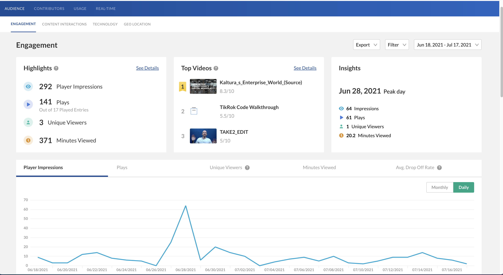

# Kaltura Node-JS Template

All the necessary components, and some nice-to-haves to get a node.js app running with the Kaltura API.

# Live Demo:

https://kaltura-embeddable-analytics.herokuapp.com/


# Intro

Kaltura has a rich and comprehensive [Analytics API](https://developer.kaltura.com/api-docs/Video-Analytics-and-Insights/media-analytics.html) that you can use to generate your own reports and analyses. You can also implement Kaltura's ready made Analytics javascript widget which provides some of the most frequently requested insights. 




For a comprehensive list of all methods and variables that are customizable with this widget, please refer to https://github.com/kaltura/analytics-front-end/blob/master/docs/loadingAnalytics.md


# How to Run

1. Install [node.js](https://nodejs.org/en/)
2. Copy [env.template](https://github.com/kaltura-vpaas/embeddable_analytics/blob/main/env.template) to .env and fill in your information
3. run npm install
4. npm run dev for developement
5. npm start for production


# Documentation

## Minimal Example:

| [Live Demo](https://kaltura-embeddable-analytics.herokuapp.com/minimal.ejs) | [Source Code](https://github.com/kaltura-vpaas/embeddable_analytics/blob/main/views/minimal.ejs) |
| :----------------------------------------------------------: | :----------------------------------------------------------: |

This minimal example is the quickest way to integrate the analytics widget into your application. By default, the last 30 days are displayed by calling the `updateFilters` API call after the `analyticsInitComplete` event is fired by the host:

```javascript
          case 'analyticsInitComplete':
            sendMessage({ messageType: 'navigate', payload: { url: '/audience/engagement' } });
            sendMessage({ messageType: 'updateFilters', payload: { queryParams: { dateBy: 'last30days' } } });
            break;
```


## Single Content Entry Example:
| [Live Demo](https://kaltura-embeddable-analytics.herokuapp.com/singleEntry.ejs) | [Source Code](https://github.com/kaltura-vpaas/embeddable_analytics/blob/main/views/singleEntry.ejs) |
| :----------------------------------------------------------: | :----------------------------------------------------------: |

The analytics widget is built to drill down to specific content entries. This example gets analytics for a single video entry:

```javascript
          case 'analyticsInitComplete':
            sendMessage({ messageType: 'navigate', payload: { url: '/entry/<%=process.env.ENTRY_ID%>' } });
```

where `process.env.ENTRY_ID` is an entryId you will supply in .env 

The following detail screens are available and can be supplied to the `url` field of `payload` as shown above 

| Description           | Payload url            |
| --------------------- | ---------------------- |
| A single video entry  | /entry/<entryId>       |
| A specific live event | /entryLive/<id>        |
| A playlist            | /playlist/<playlistId> |
| A user                | /user/<userId>         |

The `navigateBack` event is used to specify the url the user is sent to when the widget's back button is pressed

```javascript
          case 'navigateBack':
            //handle this as needed in your deployment
            window.location="/";
            break;
```

## Single View Example

| [Live Demo](https://kaltura-embeddable-analytics.herokuapp.com/singleView.ejs) | [Source Code](https://github.com/kaltura-vpaas/embeddable_analytics/blob/main/views/singleView.ejs) |
| :----------------------------------------------------------: | :----------------------------------------------------------: |

It is possible to provide only a specific view from the full menu. First, the menu is hidden:

```javascript
  <script>
    var config = {
  		...
      menuConfig: {
        showMenu: false
      },
    };
```

Next when `analyticsInitComplete` the url of `audience/engagement` is supplied as the `payload` for the `navigate` message. 

```javascript
 case 'analyticsInitComplete':
            sendMessage({ messageType: 'navigate', payload: { url: 'audience/engagement' } });
```

Here is the full list of view urls that are available, these map exactly to the main menu from the first example and they can also be found if you inspect the [menusConfig](https://github.com/kaltura-vpaas/embeddable_analytics/blob/main/views/singleView.ejs#L52) object in a javascript debugger:

```json
								audience/engagement
                audience/content-interactions
                audience/technology
                audience/geo-location
                bandwidth/publisher
                bandwidth/end-user
                live
```

## Customize The UI

| [Live Demo](https://kaltura-embeddable-analytics.herokuapp.com/singleView.ejs) | [Source Code](https://github.com/kaltura-vpaas/embeddable_analytics/blob/main/views/singleView.ejs) |
| :----------------------------------------------------------: | :----------------------------------------------------------: |

## viewConfig Object

```json
[
    "audience": {
        "engagement": {
            "export": {},
            "refineFilter": {
                "mediaType": {},
                "entrySource": {},
                "tags": {},
                "owners": {},
                "categories": {},
                "geo": {}
            },
            "miniHighlights": {},
            "miniTopVideos": {},
            "miniPeakDay": {},
            "topVideos": {},
            "highlights": {},
            "impressions": {},
            "syndication": {}
        },
        "contentInteractions": {
            "export": {},
            "refineFilter": {
                "mediaType": {},
                "entrySource": {},
                "tags": {},
                "owners": {},
                "categories": {},
                "geo": {}
            },
            "miniInteractions": {},
            "miniTopShared": {},
            "topPlaybackSpeed": {},
            "topStats": {},
            "interactions": {},
            "moderation": {}
        },
        "geo": {
            "export": {},
            "refineFilter": {
                "geo": {},
                "tags": {},
                "categories": {}
            }
        },
        "technology": {
            "export": {},
            "devices": {},
            "topBrowsers": {},
            "topOs": {}
        }
    },
    "bandwidth": {
        "endUser": {
            "export": {},
            "refineFilter": {
                "mediaType": {},
                "entrySource": {},
                "owners": {},
                "geo": {}
            }
        },
        "publisher": {
            "export": {},
            "refineFilter": {
                "mediaType": {},
                "entrySource": {},
                "geo": {}
            }
        }
    },
    "contributors": {
        "export": {},
        "refineFilter": {
            "mediaType": {},
            "entrySource": {},
            "tags": {},
            "owners": {},
            "categories": {},
            "geo": {}
        },
        "miniHighlights": {},
        "miniTopContributors": {},
        "miniTopSources": {},
        "highlights": {},
        "contributors": {},
        "sources": {}
    },
    "entry": {
        "title": {},
        "export": {},
        "refineFilter": {
            "geo": {},
            "owners": {},
            "categories": {}
        },
        "details": {},
        "totals": {
            "social": {
                "likes": {},
                "shares": {}
            }
        },
        "entryPreview": {},
        "userEngagement": {
            "userFilter": {}
        },
        "performance": {},
        "impressions": {},
        "geo": {},
        "devices": {},
        "syndication": {}
    },
    "entryLive": {
        "export": {},
        "toggleLive": {},
        "details": {},
        "users": {},
        "bandwidth": {},
        "geo": {},
        "status": {},
        "player": {},
        "streamHealth": {},
        "devices": {},
        "discovery": {}
    },
    "playlist": {
        "title": {},
        "export": {},
        "refineFilter": {
            "geo": {},
            "owners": {},
            "categories": {}
        },
        "details": {},
        "totals": {},
        "performance": {},
        "videos": {}
    },
    "user": {
        "export": {},
        "refineFilter": {
            "mediaType": {},
            "entrySource": {},
            "tags": {},
            "categories": {}
        },
        "totals": {},
        "geoDevices": {},
        "lastViewedEntries": {},
        "insights": {
            "minutesViewed": {},
            "plays": {},
            "domains": {},
            "sources": {}
        },
        "viewer": {
            "viewedEntries": {},
            "engagement": {}
        },
        "contributor": {
            "mediaUpload": {},
            "topContent": {},
            "sources": {}
        }
    }
]
```


# How you can help (guidelines for contributors) 

Thank you for helping Kaltura grow! If you'd like to contribute please follow these steps:
* Use the repository issues tracker to report bugs or feature requests
* Read [Contributing Code to the Kaltura Platform](https://github.com/kaltura/platform-install-packages/blob/master/doc/Contributing-to-the-Kaltura-Platform.md)
* Sign the [Kaltura Contributor License Agreement](https://agentcontribs.kaltura.org/)

# Where to get help
* Join the [Kaltura Community Forums](https://forum.kaltura.org/) to ask questions or start discussions
* Read the [Code of conduct](https://forum.kaltura.org/faq) and be patient and respectful

# Get in touch
You can learn more about Kaltura and start a free trial at: http://corp.kaltura.com    
Contact us via Twitter [@Kaltura](https://twitter.com/Kaltura) or email: community@kaltura.com  
We'd love to hear from you!

# License and Copyright Information
All code in this project is released under the [AGPLv3 license](http://www.gnu.org/licenses/agpl-3.0.html) unless a different license for a particular library is specified in the applicable library path.   

Copyright © Kaltura Inc. All rights reserved.   
Authors and contributors: See [GitHub contributors list](https://github.com/kaltura/YOURREPONAME/graphs/contributors).  

### Open Source Libraries Used
